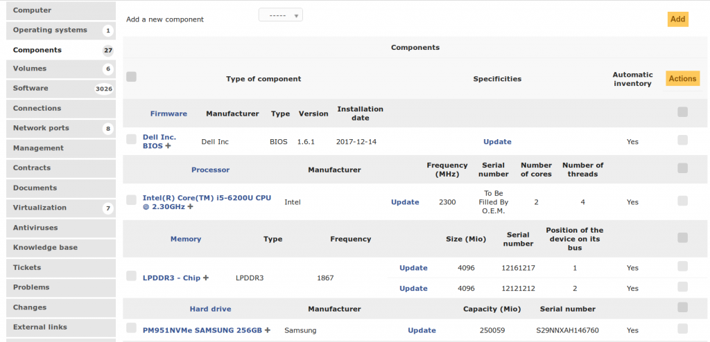

## About GLPI

GLPI stands for **Gestionnaire Libre de Parc Informatique** is a Free Asset and IT Management Software package, that provides ITIL Service Desk features, licenses tracking and software auditing.

GLPI features:
* Inventory of computers, peripherals, network printers and any associated components through an interface, with inventory tools such as: [FusionInventory](http://fusioninventory.org/) or [OCS Inventory](https://www.ocsinventory-ng.org/fr/)
* Data Center Infrastructure Management (DCIM)
* Item lifecycle management
* Licenses management (ITIL compliant)
* Management of warranty and financial information (purchase order, warranty and extension, damping)
* Management of contracts, contacts, documents related to inventory items
* Incidents, requests, problems and changes management
* Knowledge base and Frequently-Asked Questions (FAQ)
* Asset reservation

Moreover, GLPI supports many [plugins](http://plugins.glpi-project.org) that provide additional features.

## License

It is distributed under the GNU GENERAL PUBLIC LICENSE Version 2 - please consult the file called [COPYING](https://raw.githubusercontent.com/glpi-project/glpi/master/COPYING.txt) for more details.

## Some screenshots

**Tickets Timeline**

**DCIM drag&drop**

**Components**

## Prerequisites

* A web server (Apache, Nginx, IIS, etc.)
* MariaDB >= 10.0 or MySQL >= 5.6
* PHP 5.6 or higher
* Mandatory PHP extensions:
    - json
    - mbstring
    - iconv
    - mysqli
    - session
    - gd (picture generation)
    - curl (CAS authentication)

* Recommended PHP extensions (to enable optional features)
    - domxml (CAS authentication)
    - imap (mail collector and users authentication)
    - ldap (users authentication)
    - openssl (encrypted communication)

 * Supported browsers:
    - IE 11+
    - Edge
    - Firefox (including 2 latests ESR version)
    - Chrome

Please, consider using browsers on editor's supported version

## Download

See :
* [releases](https://github.com/glpi-project/glpi/releases) for tarball packages.
* [Remi's RPM repository](http://rpms.remirepo.net/) for RPM packages (Fedora, RHEL, CentOS)

## Documentation

Here is a [pdf version](https://forge.glpi-project.org/attachments/download/1901/glpidoc-0.85-en-partial.pdf).
We are working on a [markdown version](https://github.com/glpi-project/doc)

* [Installation](https://readthedocs.org/projects/glpi-install/)
* [Update](https://glpi-install.readthedocs.io/en/latest/update.html)

## Additional resources

* [Official website](http://glpi-project.org)
* [Demo](http://demo.glpi-project.org/)
* [Translations on transifex service](https://www.transifex.com/glpi/public/)
* [Issues](https://github.com/glpi-project/glpi/issues)
* [Suggestions](http://suggest.glpi-project.org)
* [Forum](http://forum.glpi-project.org)
* IRC : irc://irc.freenode.org/glpi
* [Development documentation](http://glpi-developer-documentation.readthedocs.io/en/master/)
* [Plugin directory](http://plugins.glpi-project.org)
* [Plugin development documentation](http://glpi-developer-documentation.readthedocs.io/en/master/plugins/index.html)

## Used JS libraries
 * [Chartist.js v0.10.1](https://github.com/gionkunz/chartist-js) MIT/WTFPL
 * [chartist-plugin-legend v0.6.0](https://github.com/CodeYellowBV/chartist-plugin-legend) ISC
 * [chartist-plugin-tooltip v0.0.17](https://github.com/tmmdata/chartist-plugin-tooltip) MIT
 * [Font-Awesome v4.7.0](https://github.com/FortAwesome/Font-Awesome) MIT
 * [fuzzy v0.1.3](https://github.com/mattyork/fuzzy) MIT
 * [gridstack.js v unknow-dev](https://github.com/gridstack/gridstack.js) MIT
 * [htmLawed v1.2.4](http://www.bioinformatics.org/phplabware/internal_utilities/htmLawed/) LGPL3/GPL2+
 * [jQuery v1.10.2](https://github.com/jquery/jquery) MIT
 * [jQuery UI v1.10.4](https://github.com/jquery/jquery-ui) MIT
 * jQuery plugins *
 * [Leaflet v1.2.0](https://github.com/Leaflet/Leaflet) BSD2S
 * [PrismJS v](https://github.com/PrismJS/prism) MIT
 * [spin.js v2.3.2](https://github.com/fgnass/spin.js) MIT
 * [TinyMCE v4.7.1](https://github.com/tinymce/tinymce) LGPL2.1
 * [Underscore.js v1.8.3](https://github.com/jashkenas/underscore) MIT
 * [Lodash v unknown](https://github.com/lodash/lodash) MIT

## Support
GLPI is a living software. Improvements are continuously made, new functionalities are being developed, and issues are being fixed.

To ease support and development, we need your help when encountering issues.
There is a GLPI version typical lifecycle:
 * A new major version (9.3) is released.
 * Minor versions (9.3.x), fixing bugs or issues, are published after several weeks.
   Please consider updating to the latest realeased minor version if you encounter some bugs or performance issues.
 * Several months after major version realesed, a new major version (9.4) is released
   Previous major versions become unsupported, please update to the new major version.
   Obviously, we provide support for the migration tools too!
